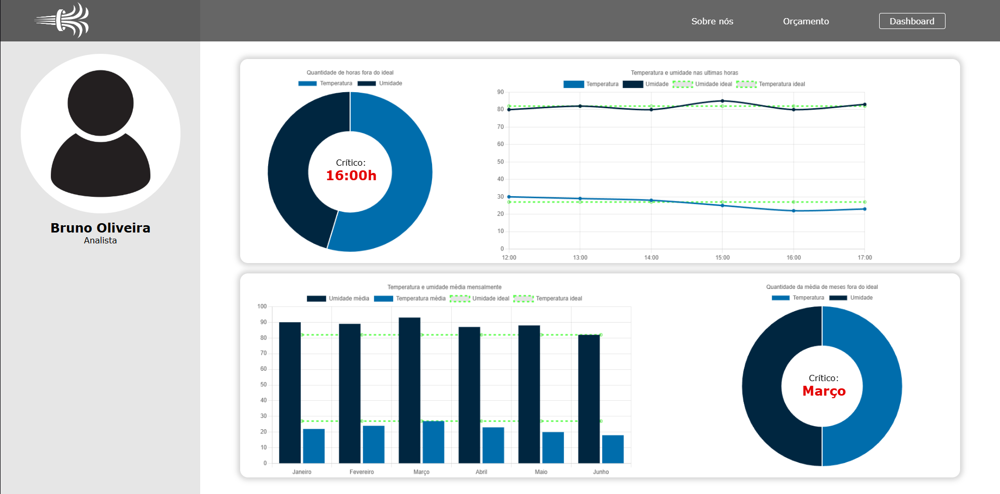

# 🌡️ Dashboard de Monitoramento Climático

Este é um projeto desenvolvido para a disciplina de Ciência da Computação da **São Paulo Tech School**, com foco na construção de um dashboard interativo que monitora a temperatura e a umidade de um ambiente ao longo do tempo.  

O sistema simula a coleta de dados em tempo real e os exibe em gráficos interativos com indicadores visuais para facilitar a análise de situações críticas.

## 📸 Interface



## 📊 Funcionalidades

- ✅ Gráfico de linha com temperatura e umidade das últimas horas
- ✅ Indicadores com **quantidade de horas fora do ideal**
- ✅ Comparação mensal com médias e faixas ideais
- ✅ Destaque visual para o horário e o mês mais críticos
- ✅ Visualização moderna com **Chart.js**

## 📐 Parâmetros considerados ideais

- **Temperatura:** aproximadamente **27°C**
- **Umidade:** aproximadamente **82%**

## 🛠️ Tecnologias Utilizadas

- HTML, CSS e JavaScript
- [Chart.js](https://www.chartjs.org/) para gráficos dinâmicos

## 🎓 Instituição

> **Curso:** Ciência da Computação  
> **Instituição:** [São Paulo Tech School](https://saopaulotech.school)  
> **Ano:** 2025

## 👨‍💻 Autor

- **Nome:** Bruno Oliveira  

---

### 📁 Como rodar localmente

1. Clone o repositório:

```bash
git clone https://github.com/TheBrunno/dashboard.example.git
cd dashboard.example
```
2. Abra o index.html no navegador:

```bash
start chartjs.html
```
> ⚠️ Não é necessário backend neste projeto, os dados são simulados diretamente no front-end.
